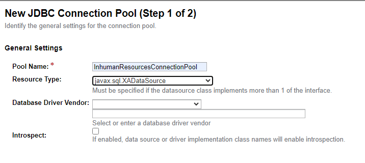
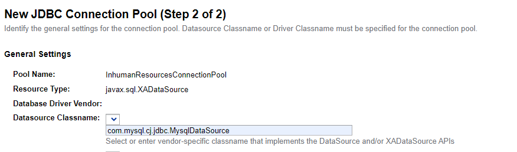
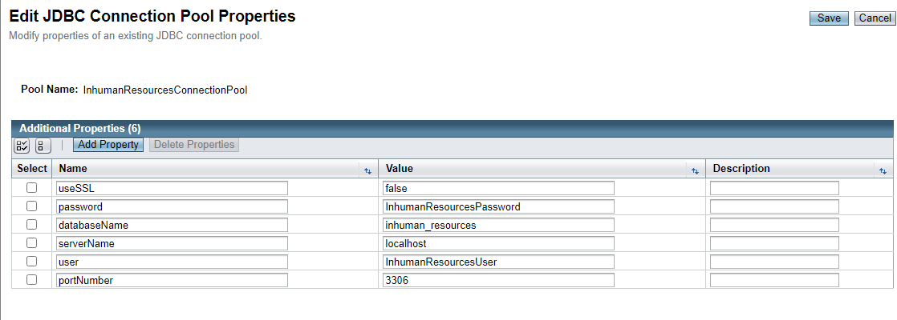
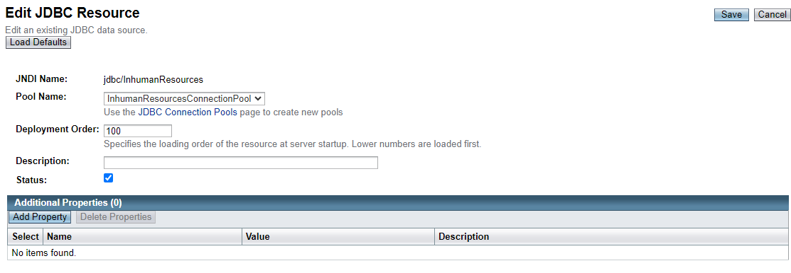

# DATABASE LOCAL CONFIGUARTION GUIDE

1. Deploy the application and go to http://localhost:4848
2. Go to JDBC -> JDBC Connection Pools -> Press New
3. Fill the form as follows, then click Next 
   
4. Add this
  
5. Add the additional properties as follows
  
6. Check the ping and click Finish
7. Go to JDBC -> JDBC Resources -> Press New
8. Fill the form as follows, then click OK
  