# GLASSFISH INTELLIJ CONFIG GUIDE
#

1. Go to Edit Configurations in Intellij:
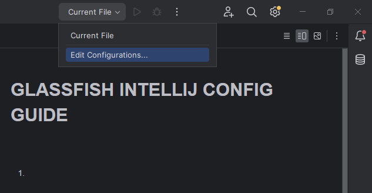
2. In the window that just appeared, click in the left pane the link "Add new..", and select Glassfish Server, Local variant:
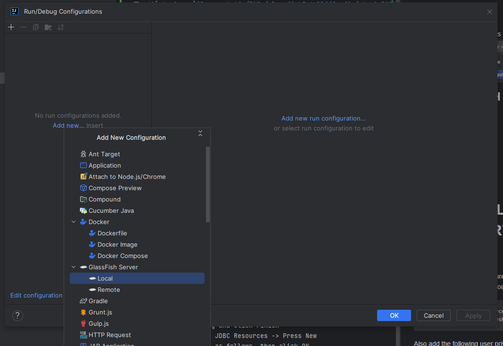
3. Make sure that the forms are filled like this:
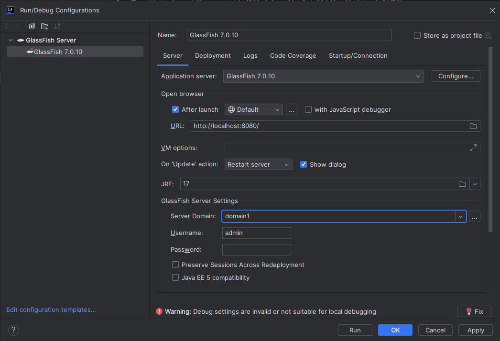
4. Click plus button at Before Launch pane
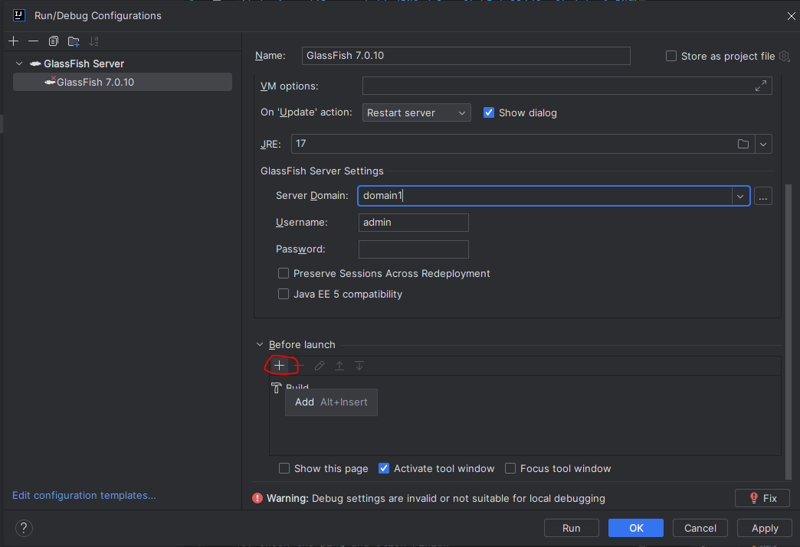
5. Select Build Artifacts from the list
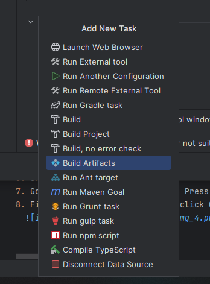
6. If this list contains a .war file, jump to step 8, otherwise continue
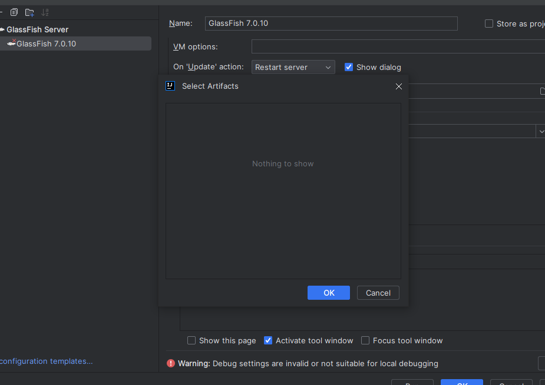
7. To get the .war file, project must be built; close the windows and go to the gradle panel and go to build and run it (double click); wait for it to finish
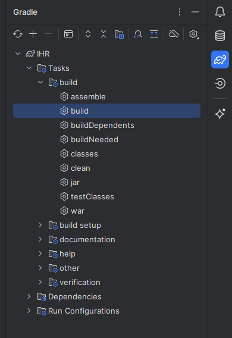
8. After the build has been completed, go back to step 6 (Select Artifacts window) and select first .war file (not exploded)
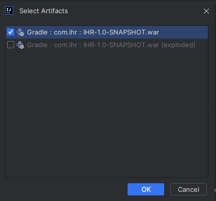
9. This is how that pane should look like
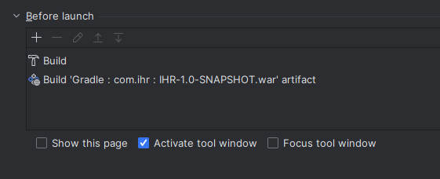
10. Go to the deployment tab of same window and add artifact
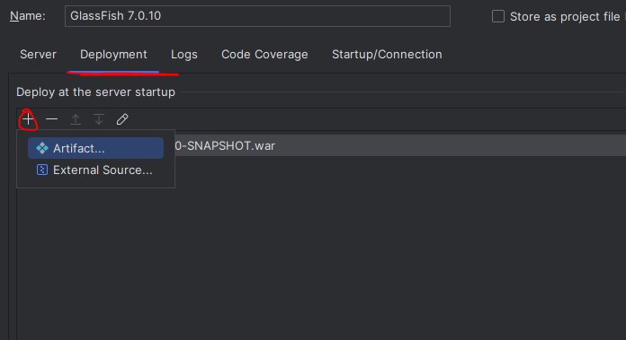
11. Select same war file as step 8
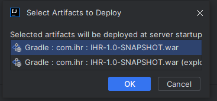
12. This is how the window should look like (click ok)
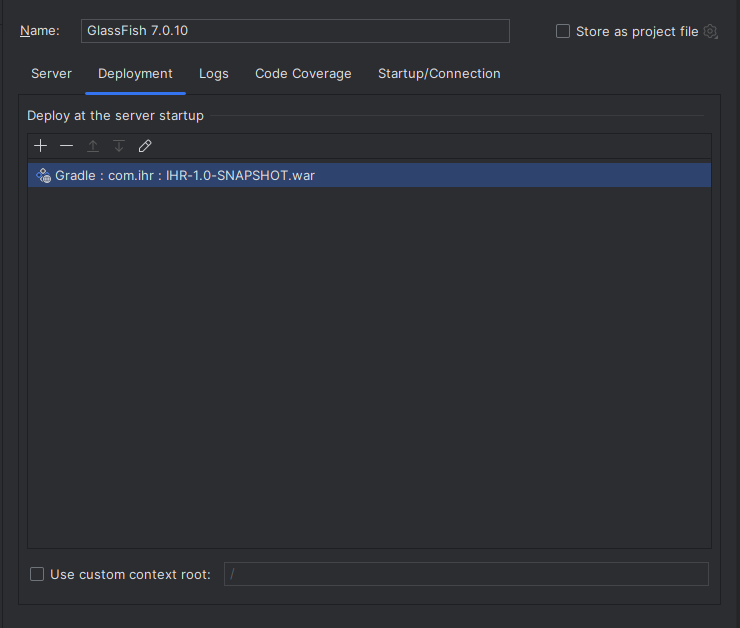
13. Now Glassfish should be available in the run list
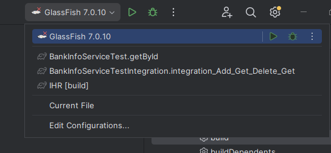

# DATABASE LOCAL CONFIGUARTION GUIDE
#
Before all the steps, make sure you have created a database
in MySQL Workbench with the name "inhuman_resources". And added a user with the following credentials:

```
Login Name: InhumanResourcesUser
Password: InhumanResourcesPassword
```
Also add the following user privileges:

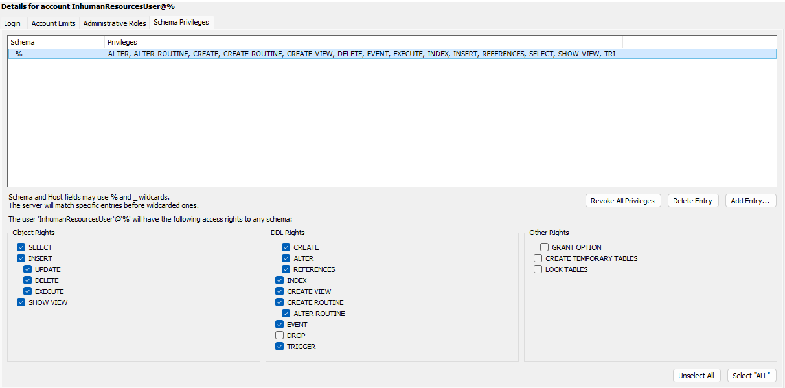


##
## Steps to configure the database:

1. Deploy the application and go to http://localhost:4848
2. Go to JDBC -> JDBC Connection Pools -> Press New
3. Fill the form as follows, then click Next 
   
4. Add this
  
5. Add the additional properties as follows
  
6. Check the ping and click Finish
7. Go to JDBC -> JDBC Resources -> Press New
8. Fill the form as follows, then click OK
  